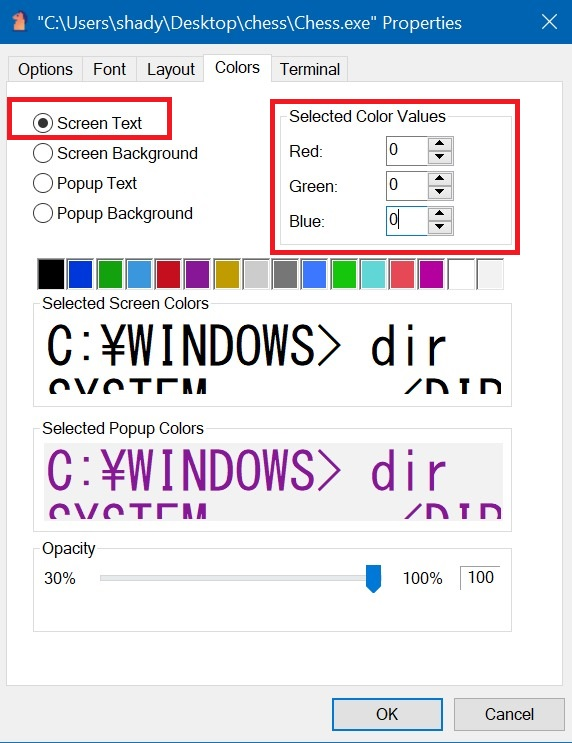

# CONSOLE CHESS TFG
## MANUAL DE USUARIO
### PREAJUSTES
#### HABILITAR SOPORTE DE CARACTERES UTF-8
Antes de abrir la aplicación es necesario realizar algunos ajustes en nuestro equipo. La aplicación utiliza caracteres especiales con codificación UTF-8 para dibujar las piezas de ajedrez en la consola por lo que debemos activar la representación de estos caracteres en el equipo:
1. Entramos en la configuración y accedemos a *Hora y Lenguaje* 
2. En el panel de la derecha seleccionamos la primera pestaña 
3. En en el panel de la derecha entramos en los ajustes adicionales 
4. Seleccionamos *Region* 
5. En la pestaña que se nos abrirá, accedemos a las opciones administrativas y hacemos click en cambiar las opciones regionales del sistema 
6. Marcamos la pestaña en laque pone usar Unicode UTF-8 para soporte de lenguaje 
7. Reiniciamos el equipo para aplicar los cambios
#### AJUSTES DE LA CONSOLA
Para poder visualizar correctamente los caracteres, debemos seleccionar una fuente que los incluya, como por ejemplo *MS Gothic*, además de cambiar el color de la fuente y de la terminal.
1. Click derecho en la ventana > *Propiedades* 
3. Ajustamos el tamaño de la fuente a uno que se apropiado para nuestra resolución y el estilo de fuenta a *MS Gothic* 
4. Cambiar el color de fondo de la terminal a blanco 
5. Cambiar el color de la fuente a negro 
6. Reiniciamos la aplicación
### USO DE LA APLICACION
La primera pantalla de la aplicación será un menú en el que podemos elegir entre 6 opciones introduciendo un número entre 1-6 y pulsando enter:

1. Jugar una partida contra IA
2. Jugar una partida en local 1 vs 1
3. Visualizar una partida de IA vs IA
4. *(Beta) Iniciar un servidor de ajedrez*
5. *(Beta) Iniciar un cliente que conecta a un servidor de ajedrez*
6. Salir de la aplicación

>*NOTA:* *FEN* es una notación que se utiliza en ajedrez para representar un tablero y el estado de una partida. Podemos generar cadenas FEN en esta página: [FEN Generator](http://www.netreal.de/Forsyth-Edwards-Notation/index.php)

#### MODOS DE JUEGO
##### JUGAR CONTRA IA
Permite jugar una partida contra una inteligencia artificial (stockfish).  Al seleccionar esta opción se nos preguntará si queremos cargar un tablero o comenzar de nuevo.
En caso de querer cargar una partida, copiaremos nuestra cadena *FEN* y seleccionaremos el equipo con el que queremos jugar.
##### JUGAR EN LOCAL 1 VS 1
Esto nos permite jugar una partida de ajedrez controlando tanto las piezas blancas como las piezas negras. Al igual que en el anterior modo de juego, podremos elegir si queremos empezar una partida con la posición inicial o iniciarle a partir de una cadena *FEN*
##### IA VS IA
Permite visualizar una partida de la IA contra la propia IA.
> *NOTA:* Es probable que la IA continue realizando los mismos movimientos en bucle
##### INICIAR SERVIDOR DE AJEDREZ (Beta)
Esto realmente no es un modo de juego en sí. Permite ser un servidor de ajedrez que acepta dos clientes que pueden disputar una partida en línea. Se imprimirán por pantalla diferentes mensajes de log que permitirá ver el movimiento de cada jugador.

##### CONECTAR A SERVIDOR DE AJEDREZ (Beta)
Este modo de juego no está finalizado, pero permite conectar a un servidor y jugar una partida de ajedrez uno contra uno en equipos diferentes.
> *NOTA:* Este modo de juego está incompleto. Por ejemplo, la coronación de peones no está disponible y la aplicación fallará si esto sucede.

#### COMO JUGAR
Se trata de una partida de ajedrez que se desarrollará conforme a todas sus reglas. Cada pieza tiene un conjunto de movimientos permitidos. También están incluídos movimientos como el enroque o la comida al paso, al igual que la coronación de peones. La partida finalizará cuando no se disponga de ningún movimiento en el que en el próximo turno el jugador contrario pueda capturar el rey.
>*NOTA:* No me ha dado tiempo a integrar los diferentes casos en los que se pueda producir un empate
##### REALIZAR UN MOVIMIENTO
Cuando sea nuestro turno, se nos pedirá introducir las coordenadas de la casilla que queramos seleccionar para mover nuestra pieza. El primer caracter debe ser el número de fila seguido de la letra de la columna, por ejemplo, 2A:

Evidentemente no podemos seleccionar una pieza que sea del equipo enemigo o una casilla que esté vacía, tampoco una que no pueda realizar ningún movimiento en ese momento. Una vez seleccionada la pieza, se nos marcará en el tablero con recuadros negros las casillas a las que nos podemos desplazar:

El proceso para realizar el movimiento sería el mismo que para seleccionar una casilla (número de columna con letra de fila). Podemos deseleccionar la pieza pulsando *X* y así poder mover otra pieza diferente.

##### CORONACION DE PEON
Si un peón llega al final del tablero podemos cambiarlo por cualquier otra pieza menos por un peón o un rey, al igual que en una partida de ajedrez normal. Se abrirá un menú en el que deberemos indicar mediante una letra la pieza que queramos:

### COMPONENTES Y FUNCIONAMIENTO DE LA APLICACION 
#### DESCRIPCION
Se trata de una aplicación de ajedrez en consola, que contiene un motor de ajedrez que podría reutilizarse para adaptarlo a una aplicación web o de escritorio con interfaz gráfica.
#### TECNOLOGIAS
La aplicación está escrita en C# y contiene una librería escrita en C++.
#### PROCESO DE REALIZACION
Para desarrollar la aplicación comencé creando las clases modelo que representarían la equivalencia con el mundo real como *Board, Piece, Tile*, que representarían un tablero de ajedrez, una pieza o una casilla del tablera. A continuación comencé con una representación gráfica sencilla para comenzar a desarrollar la lógica.

A partir de esto comencé a desarrollar una clase muy importante en la aplicación: *FenConverter*, que me permitiría instanciar tableros de ajedrez de forma sencilla y que más adelante permitiría la implementación de la IA en la aplicación.

Después de esto desarrollé toda la lógica del movimiento de las piezas y el cálculo del jaque y del jaque mate. 

Una vez terminada toda la lógica del juego, implementé los diferentes modos de juego.
#### DIAGRAMA UML

#### LIBRERIAS
##### STOCKFISH
Es la única librería que contiene el proyecto. Se trata de un intermediario que permite interactuar con la IA de ajedrez *Stockfish* a través de clases de C#. He utilizado esta librería para los modos de juego de *Jugador vs IA* e *IA vs IA*. Funciona de la siguiente manera: se le proporciona una cadena **FEN** con toda la información sobre el siguiente turno y devuelve una cadena de *string* con el mejor movimiento que es capaz de calcular.
Instanciación de la clase **Stockfish**:
````csharp
IStockfish stockfish = new Stockfish.NET.Stockfish(@"stockfish.exe");
````
Establecemos la cadena *FEN* a través de la cual *Stockfish* calculará el mejor movimiento:
````csharp
stockfish.SetFenPosition(fullFen);
````
Ejecutamos la función que nos devolverá una cadena con el movimiento en forma de *string*:
````csharp
string stockfishMove = stockfish.GetBestMove();
````
#### POSIBLES MEJORAS
- Cambiar de una aplicación de consola a una con interfaz gráfico 
- Montar un servidor general donde se pudieran conectar clientes, crear una cuenta y jugar. Pudiendo registrar sus estadísticas de juego
- Mejorar el motor de juego incluyendo la funcionalidad de detectar un empate
- Incluir la posibilidad de rendición
- Incluir la posibilidad de registrar todos los movimientos a lo largo de una partida
- Refactorización, optimización y mejora del código en general